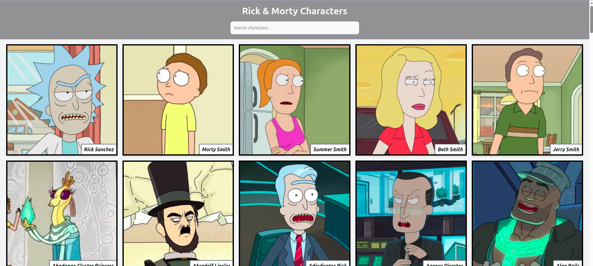
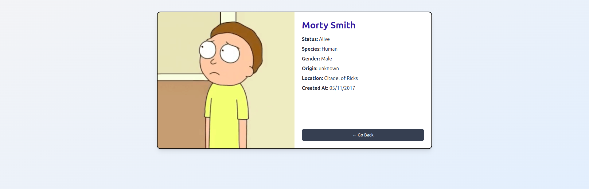

# Rick & Morty Characters

This project was bootstrapped with [Create React App](https://github.com/facebook/create-react-app).

## Available Scripts

In the project directory, you can run:

### `npm start`

Runs the app in development mode.  
Open [http://localhost:3000](http://localhost:3000) to view it in the browser.  
The page will reload if you make edits.

### `npm run build`

Builds the app for production to the `build` folder.  
It bundles React in production mode and optimizes the build for best performance.

## Learn More

- [React documentation](https://reactjs.org/)
- [Create React App documentation](https://facebook.github.io/create-react-app/docs/getting-started)

## Preview

